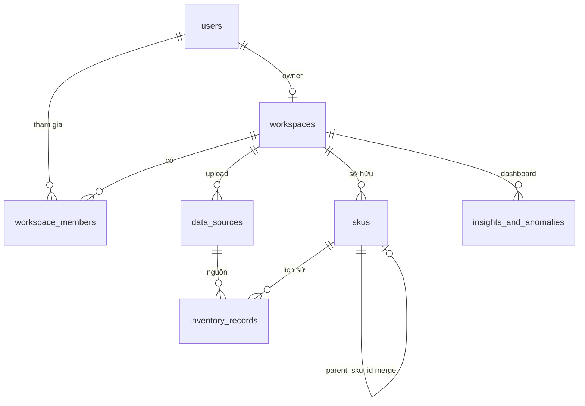

# SupplyForge AI

**Supply Chain OS** dành cho các nhà bán lẻ thương mại điện tử (E-commerce) tại khu vực Đông Nam Á. Hệ thống giúp tối ưu hóa quản lý tồn kho, dòng tiền và SKU bằng trí tuệ nhân tạo (AI), được thiết kế để vận hành hiệu quả trên các VPS cấu hình thấp nhưng vẫn sẵn sàng mở rộng thành microservices.

### 🚀 Khả năng hiện tại của hệ thống:

1.  **Nhập liệu thông minh (Trust Theater):**
    *   Hỗ trợ nhập dữ liệu từ các file Excel (`.xlsx`) và CSV cực lớn nhờ cơ chế **Streaming SAX**, không gây tràn bộ nhớ (OOM).
    *   **AI Column Mapping:** Sử dụng Google Gemini `gemini-1.5-flash` để tự động nhận diện và ánh xạ các cột dữ liệu từ file của người dùng (kể cả tiếng Việt sai chính tả) sang chuẩn hệ thống.
2.  **Quản lý SKU Tập trung (Tinder for SKUs):**
    *   Tự động phát hiện các SKU bị trùng lặp hoặc có tên tương tự nhau.
    *   **Giao diện Vuốt (Tinder-style):** Cho phép người dùng gộp các SKU trùng lặp chỉ bằng thao tác vuốt trái/phải hoặc click đơn giản, giúp làm sạch dữ liệu kho nhanh chóng.
3.  **Dashboard Phân tích Tồn chết (Dead Stock Analytics):**
    *   Nhận diện các mặt hàng không có biến động kho trong thời gian dài (mặc định >45 ngày).
    *   **Loss Aversion Framing:** Hiển thị số tiền đang bị "đóng băng" trong kho dưới dạng cảnh báo đỏ để nhấn mạnh thiệt hại tài chính, giúp chủ shop có kế hoạch xả hàng kịp thời.
4.  **Kiến trúc Đa Tenant (Multi-tenancy):**
    *   Hỗ trợ quản lý theo Workspace. Dữ liệu của từng shop được tách biệt hoàn toàn thông qua `workspace_id`.
5.  **Tối ưu hóa Hiệu năng:**
    *   Sử dụng cơ chế Materialized Insights (lưu kết quả tính toán sẵn vào DB) giúp Dashboard tải nhanh mà không cần quét lại toàn bộ lịch sử giao dịch mỗi lần truy cập.

---

## 1. Tổng quan hệ thống

| Lớp | Vai trò |
|-----|---------|
| **Frontend** | Next.js 14 (App Router), TypeScript, Tailwind, Framer Motion — dashboard upload, “Trust Theater”, gộp SKU kiểu thẻ, dashboard dead stock. |
| **Backend** | Spring Boot 3.x, Java 21 — API đa tenant, xử lý file lớn (streaming, không OOM), tích hợp LLM map cột, job batch ghi DB. |
| **Database** | PostgreSQL — multi-tenant qua `workspace_id`, chỉ mục theo tenant để query dashboard nhanh. |
| **Object storage** | AWS S3 hoặc Cloudflare R2 (file Excel/CSV gốc). |
| **AI** | Google Gemini `gemini-1.5-flash` (hoặc Spring AI) — chỉ gọi trên **mẫu nhỏ** (header + vài dòng), không gửi cả file 50k dòng. |

Luồng giá trị chính:

1. Seller upload báo cáo kho / bán hàng (Excel/CSV).
2. Hệ thống **map cột tiếng Việt** (kể cả sai chính tả) sang chuẩn nội bộ bằng LLM một lần.
3. **Ingest hàng loạt** bằng Java streaming vào `skus` + `inventory_records`.
4. Phát hiện SKU trùng (chuẩn hóa + khoảng cách chuỗi) — UI “Tinder” để gộp (`parent_sku_id`).
5. Tiền tính toán **dead stock / anomaly** vào `insights_and_anomalies` để dashboard đọc nhanh, không quét lại toàn bộ bảng mỗi lần mở trang.

---

## 2. Cấu trúc thư mục

```
supplyforge-ai/
├── backend/                 # Spring Boot API
│   ├── src/main/java/.../domain/
│   │   ├── entity/          # JPA entities (map bảng PostgreSQL)
│   │   ├── model/          # Enum trạng thái (DataSourceStatus, …)
│   │   └── repository/     # Spring Data JPA
│   └── src/main/resources/
│       ├── application.yml
│       └── db/migration/   # Flyway (V1__init_core_schema.sql, …)
├── frontend/                # Next.js 14
│   └── src/app/            # App Router, UI MVP
├── scripts/
│   └── init-structure.ps1
├── docker-compose.yml
├── .env.example
└── README.md
```

---

## 3. Cơ sở dữ liệu (PostgreSQL)

Migration được quản lý bởi **Flyway** (`ddl-auto: none` trên môi trường thật — chỉ Flyway được phép đổi schema).

### 3.1. Sơ đồ logic (multi-tenant)



### 3.2. Bảng cốt lõi

| Bảng | Mục đích |
|------|-----------|
| **users** | Tài khoản đăng nhập; `email` unique; `password_hash` (MVP có thể bổ sung OAuth sau). |
| **workspaces** | **Tenant** — mỗi shop / tổ chức; `slug` unique; `owner_user_id` gợi ý chủ workspace. |
| **workspace_members** | Nhiều user trong một workspace; `role`: OWNER / ADMIN / MEMBER. |
| **data_sources** | File đã upload: tên gốc, `storage_key` (S3/R2), `status` (PENDING → PROCESSING → READY / FAILED), `row_count`, `column_mapping_json` (kết quả map LLM). |
| **skus** | SKU theo workspace: `original_name`, `normalized_name`, `is_duplicate`, `parent_sku_id` (gộp nhóm). |
| **inventory_records** | Theo `sku_id`: `record_date`, `quantity`, `cost_price`, `selling_price`; liên kết `data_source_id` để trace. |
| **insights_and_anomalies** | Bản ghi **đã tính sẵn** cho dashboard: dead stock, ước tính thiệt hại, payload JSON (`JSONB`), `computed_at`, `valid_until`. |

Chỉ mục quan trọng: lọc theo `(workspace_id, …)` và thời gian (`computed_at`) để giảm tải CPU/RAM trên VPS.

---

## 4. Import spreadsheet (Bước 3)

**Luồng:** file tạm trên disk → **peek** (chỉ sheet đầu: header + 5 dòng) qua **SAX / streaming** (`.xlsx` dùng `XSSFReader`, không load cả workbook) hoặc CSV dòng-by-dòng → gọi **OpenAI** `gpt-4o-mini` với payload nhỏ (`response_format: json_object`) → lưu `column_mapping_json` trên `data_sources` → **ingest** toàn file streaming, ghi `skus` + `inventory_records` theo batch (flush + `EntityManager.clear` để giữ heap thấp).

**Endpoint:** `POST /api/v1/workspaces/{workspaceId}/imports/spreadsheet` — `multipart/form-data`, field `file` (`.xlsx` hoặc `.csv`).

**Biến môi trường:** `GEMINI_API_KEY` (trống → heuristic map cột 0/1/2 cho dev). Xem `.env.example`.

**Transaction:** `DataSource` được tạo trong `REQUIRES_NEW` (commit trước); ingest trong transaction riêng; lỗi → `DataSourceStatusService.markFailed` (transaction mới) để không mất trace khi rollback ingest.

---

## 5. Backend — kiến trúc mã

- **Entities** (`domain.entity`): map 1-1 với Flyway; `BaseAuditableEntity` chuẩn hóa `created_at` / `updated_at`. *(Getter/setter viết tay — tương thích JDK mới không cần Lombok.)*
- **Repositories** (`domain.repository`): interface Spring Data; truy vấn theo `workspaceId` / `status` / khoảng thời gian — phù hợp thêm **QueryDSL / custom @Query** khi phức tạp.
- **DTO + Service layer** (các bước sau): API không trả thẳng entity; tách **Application Service** (use case) khỏi persistence để sau này tách microservice không đổi contract.

**Bảo mật MVP:** `SecurityConfiguration` đang mở `/api/**` cho scaffold; production cần JWT / session theo workspace và siết `authorizeHttpRequests`.

**Test:** `src/test/resources/application.yml` tắt Flyway, dùng **H2 in-memory** + `ddl-auto: create-drop` để `mvn test` không cần Postgres.

---

## 6. Frontend — Bước 4 & 5 (đã có trong `frontend/`)

- **Typography:** Inter (subset Latin + Vietnamese).
- **Màu:** `trust-navy`, `trust-blue`, `alert-shopee` — cảnh báo kiểu seller center.
- **Tab “Nhập file”:** **Trust Theater** — console giả lập 3 bước xong nhanh; bước 4 “AI Cloud” giữ trạng thái *Loading* trong lúc `multipart` upload thật lên backend, xong mới *Done*.
- **Tab “Gộp SKU”:** thẻ kiểu **Tinder** — vuốt trái bỏ qua, vuốt phải gộp; có **Đổi vai trò** cha/con; API `GET/POST` dưới đây.
- **Tab “Tồn chết”:** thẻ đỏ **loss aversion** (VNĐ), dòng phụ 30 ngày, CTA “Xả hàng bằng AI” (placeholder), bảng top SKU đóng băng.

**Biến frontend:** `NEXT_PUBLIC_API_URL`, `NEXT_PUBLIC_WORKSPACE_ID` (mặc định `1` khớp seed Flyway `V2`).

### API liên quan Bước 4–5

| Method | Path | Mô tả |
|--------|------|--------|
| `GET` | `/api/v1/workspaces/{id}/sku-merge/candidates` | Cặp SKU gợi ý (Levenshtein ≤ 2, tối đa ~80 cặp, quét tối đa 600 SKU gốc). |
| `POST` | `/api/v1/workspaces/{id}/sku-merge/merge` | Body JSON `{ "parentSkuId", "childSkuId" }`. |
| `GET` | `/api/v1/workspaces/{id}/dashboard/dead-stock` | Đọc snapshot `insights_and_anomalies` còn TTL hoặc tính + ghi snapshot. |
| `POST` | `/api/v1/workspaces/{id}/dashboard/dead-stock/refresh` | Ép tính lại & lưu snapshot. |

**CORS:** `supplyforge.cors.allowed-origins` / `CORS_ALLOWED_ORIGINS` (mặc định `http://localhost:3000`).

**Dead stock (MVP):** SKU gốc (`parent_sku_id` null), bản ghi tồn **mới nhất** theo ngày; “chết” nếu `record_date` cũ hơn **45 ngày** và `quantity > 0`. Giá trị đóng băng ≈ `quantity ×` (giá vốn, hoặc 70% giá bán nếu không có vốn). **Ước thiệt hại 30 ngày** = 4,5% giá trị tồn chết (hệ số MVP).

---

## 7. Chạy nhanh (Docker)

Yêu cầu: Docker + Docker Compose.

```powershell
cd supplyforge-ai
copy .env.example .env
# Chỉnh mật khẩu Postgres / URL API nếu cần
docker compose up --build
```

| Dịch vụ | URL |
|---------|-----|
| Frontend | http://localhost:3000 |
| API ping | http://localhost:8080/api/v1/ping |
| Health (PaaS) | http://localhost:8080/actuator/health |
| PostgreSQL | localhost:5432 |

Lần đầu chạy backend, **Flyway** áp `V1__init_core_schema.sql` và **`V2__seed_demo_workspace.sql`** (user + workspace slug `demo` — thường `workspaces.id = 1`).

---

## 8. Chạy dev cục bộ (không Docker)

### Backend

1. Cài **PostgreSQL 16**, tạo DB `supplyforge` (hoặc đổi trong `.env`).
2. Cấu hình `SPRING_DATASOURCE_*` giống `.env.example`.
3. Trong thư mục `backend`:

```powershell
mvn spring-boot:run
```

### Frontend

```powershell
cd frontend
npm install
npm run dev
```

Đặt `NEXT_PUBLIC_API_URL=http://localhost:8080` và `NEXT_PUBLIC_WORKSPACE_ID=1` (hoặc id workspace thực tế).

---

## 9. Deploy (Render / Railway / VPS)

- **Build:** Dockerfile đa tầng — backend chỉ ship **JRE 21 Alpine** + fat JAR; frontend **Next.js standalone** (image Node nhỏ).
- **Database:** dịch vụ PostgreSQL managed hoặc container riêng; trỏ `SPRING_DATASOURCE_URL` tới JDBC URL thật.
- **Biến môi trường:** xem `.env.example`; thêm sau: `OPENAI_API_KEY`, khóa S3/R2, `JWT_SECRET` (khi bật auth).
- **Health check:** PaaS nên gọi `GET /actuator/health`.

---

## 10. Tiến độ kế hoạch (theo từng bước)

| Bước | Nội dung | Trạng thái |
|------|-----------|------------|
| 1 | Monorepo, Docker, Spring + Next scaffold | Hoàn thành |
| 2 | Flyway + JPA entities + repositories + README | Hoàn thành |
| 3 | Streaming Excel (SAX) + OpenAI map cột + ingest batch | Hoàn thành |
| 4 | Trust Theater + Tinder SKU (UI + API) | Hoàn thành |
| 5 | Dashboard dead stock & loss framing | Hoàn thành |

---

## 11. Nguyên tắc vận hành chi phí thấp

- **LLM:** chỉ trên snapshot header + vài dòng mẫu.
- **Ingest:** stream / batch JDBC, không load full workbook vào heap.
- **Dashboard:** đọc `insights_and_anomalies` đã materialize; làm mới insight theo lịch hoặc sau ingest.
- **Pool DB:** Hikari giới hạn kết nối (xem `application.yml`).

---

## 12. License & đóng góp

Dự án MVP nội bộ; cập nhật license khi open source. Pull request nên kèm migration Flyway mới (`V2__...sql`) thay vì đổi tay schema production.

---

*Có thể mở rộng tiếp: auth JWT theo workspace, upload S3/R2, job async ingest, prompt “kế hoạch xả hàng” gọi OpenAI.*
